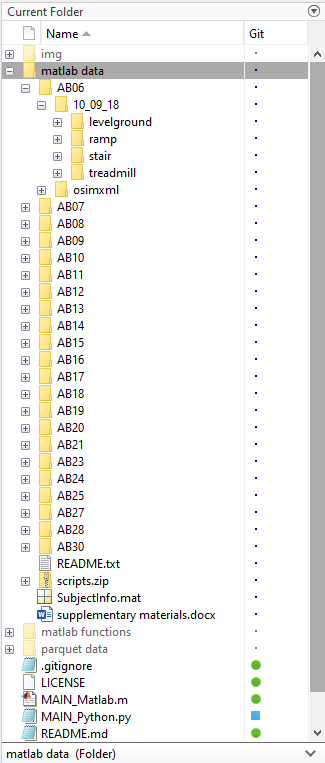
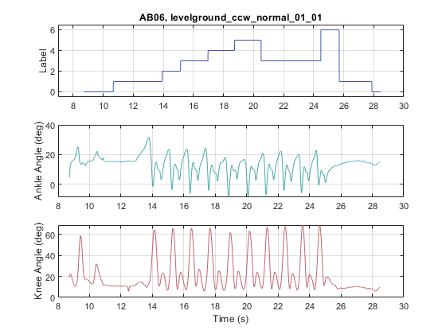
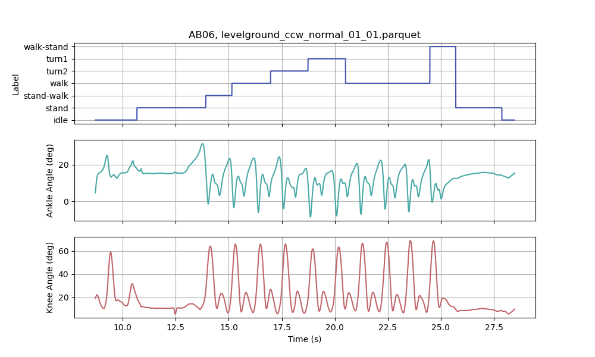
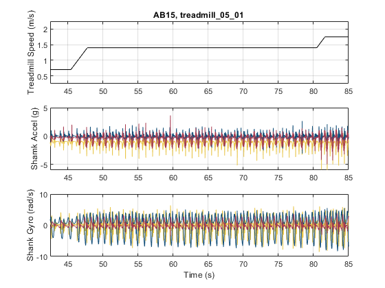
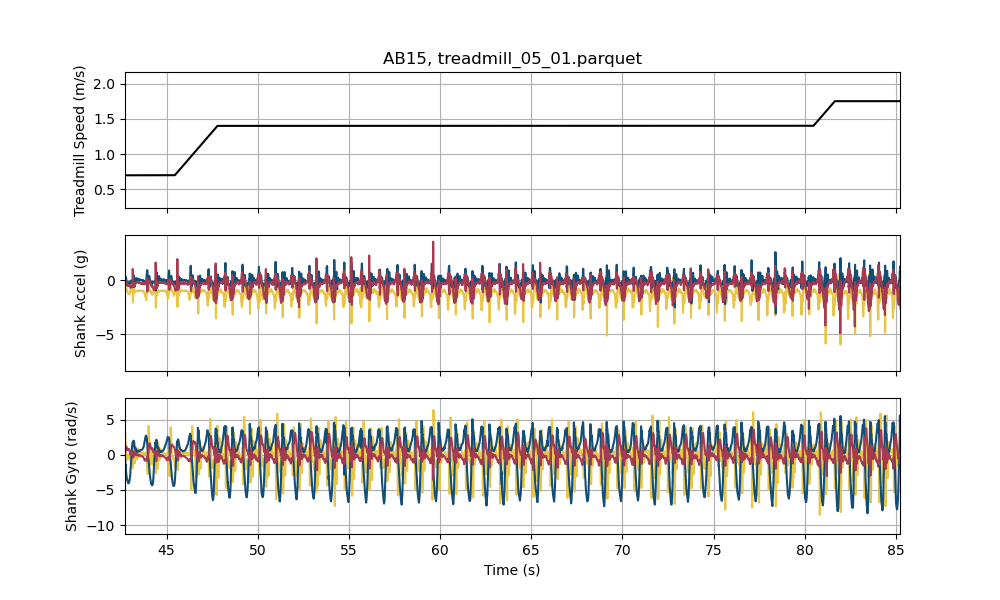
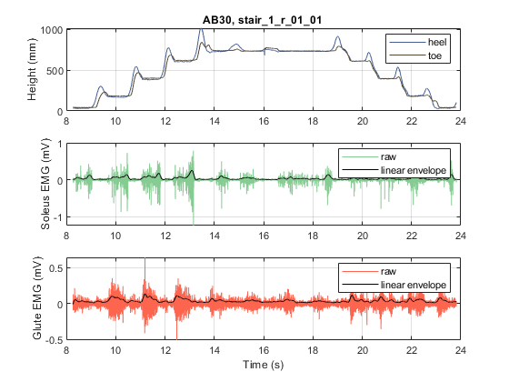
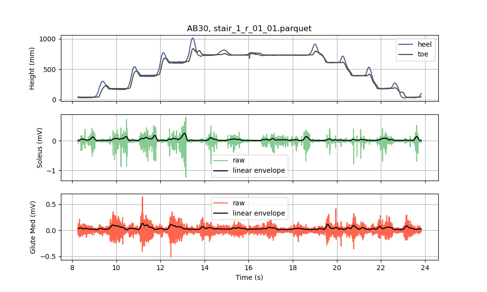

# convert-ga-tech-walking-data

The Epic Lab at Georgia Tech created a nice open-source database of gait data collected from healthy subjects walking in a variety of conditions.
The details of the data and collection procedures can be found in:

[Camargo et al., A comprehensive, open-source dataset of lower limb
biomechanics in multiple conditions of stairs, ramps, and level-ground
ambulation and transitions., Journal of Biomechanics, 2021.](https://www.sciencedirect.com/science/article/pii/S0021929021001007)

I've found myself wanting to use this dataset for a variety of projects, but as all of the files are stored as .mat files, I've been unable to load them into Python (my scientific computing language of choice). [.mat files](https://www.mathworks.com/help/matlab/import_export/mat-file-versions.html) are a proprietary binary file format created by MathWorks for use with Matlab. It seems like there should be a way to load a .mat file into Python. There is a [function in the scipy package](https://docs.scipy.org/doc/scipy/reference/generated/scipy.io.loadmat.html) that supposedly loads .mat files, but I could not get it to load any of the GA Tech data in a reasonable format.

To access the data, I decided to write a Matlab script (and set of functions) that converts the database to another open-source file format that is compatible with Matlab, Python, and other programing languages. The file format that I've selected is [Apache Parquet](https://parquet.apache.org/), which is optimized for columnar data.

## Matlab Code

MAIN_Matlab.m is a script that converts the database from a .mat format to a .parquet format. The script assumes that the database in the same directory, inside of a folder titled 'matlab data', where each subfolder is a participant's data folder. This is the same way the data is organzied when you download it from the [Epic Lab website](https://www.epic.gatech.edu/opensource-biomechanics-camargo-et-al/). You'll need to unzip each participant's folder, so that the 'matlab data' directory is structured as shown:

When MAIN_Matlab.m is run, it will create another subdirectory called 'parquet data' that mirrors the matlab data directory and will fill each folder with parquet data. Parquet files can be read by Matlab and by Python via the Pandas package.

The GA Tech database uses the date of the data collection for each participant as the name of one of the high-level subdirectory/folder names for organizational purposes. I've gathered the dates for each participant and placed them in the .csv file 'subject_date_key', and one of the functions uses this file to create the folder name in the parquet data directory.

To ensure that the database conversion software worked without any bugs, I decided to plot randomly selected parts of the database in Matlab/.mat and Python/.parquet, and compare the plots visually. The script "verification_plots.m" creates three subplots. Each plot contains data from a unique participant engaging in a unique activity. These figures are reproduced in Python and are shown below. 

## Python Code

MAIN_Python.py recreates the same three figures described above from the parquet database. Each figure is shown below.

### Subject AB06, Levelground Walking, Activity Labels and Joint Angles

Matlab:

Python:

This trial contained data from one subject walking on levelground with two turns. The top row shows the activity labels for the trial, the middle and bottom rows show the ankle
and knee angles, respectively, as calculated with OpenSim's inverse kinematics tools.

### Subject AB15, Treadmill Walking, IMU Signals

Matlab:

Python:

This trial contained data from another subject walking on a treadmill at multiple speeds. The top row shows treadmill speed. The middle row shows three channels of acceleration
data from a shank-mounted IMU. The bottom row shows the gyroscope data from the same IMU.

### Subject AB30, Stair Ascent/Descent, Foot Markers and Select EMG Signals

Matlab:

Python:

This trial contained data from a third subject climbing and descending a flight of stairs. The top row shows the heel/toe motion capture marker height over time. The middle and
bottom rows show the EMG signals from the soleus and gluteus medius. I've also computed and plotted the linear envelope for the two signals.

Across all three randomly selected trials, the .mat and .parquet files show good agreement, so I'm reasonably certain there are no bugs. Hopefully this is useful for someone
else out there. 
